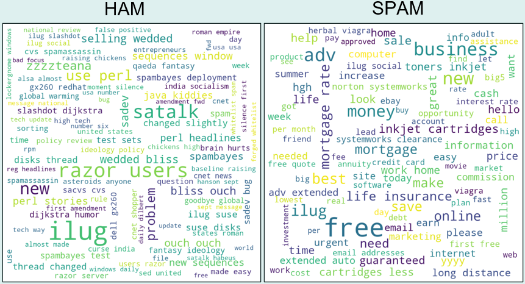
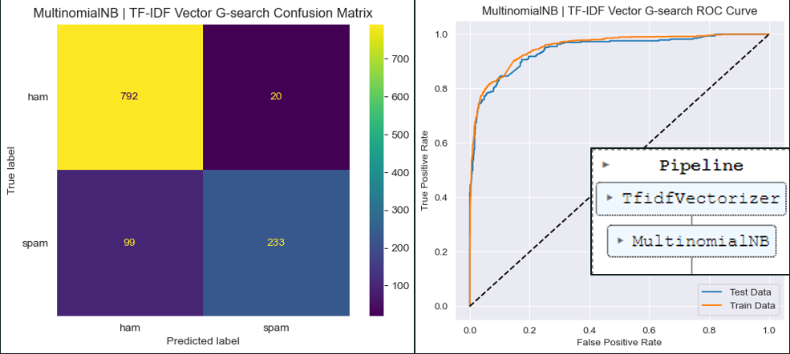
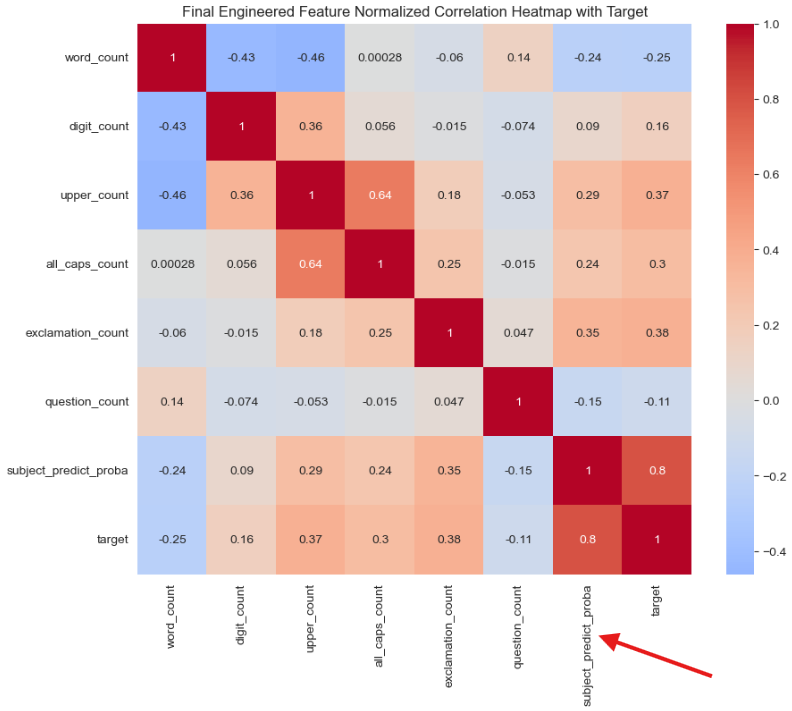
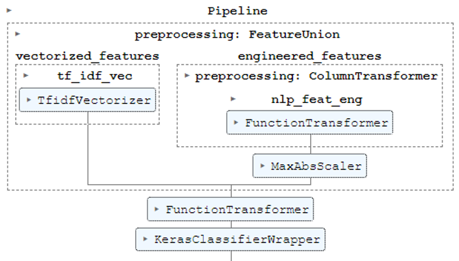
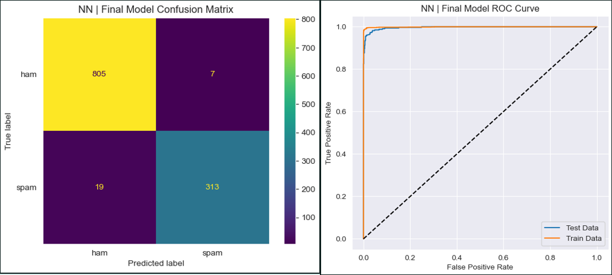
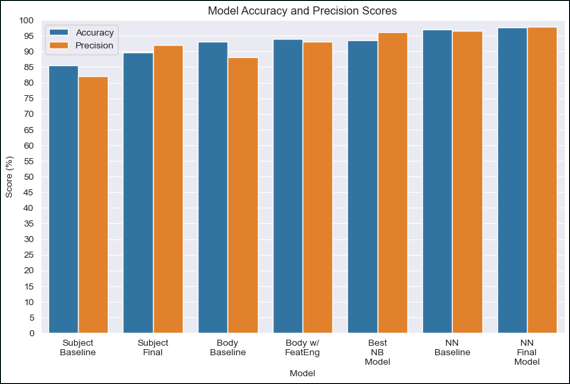

# Spam Email Filter ML Model
## Analysis Overview
This project analyzes over 5k email files. We will perform Exporatory Data Analysys (EDA) to assess the data, and create machine learning models to predict the outcome of a target variable (HAM (good emails) vs. SPAM).

## Business Problem
Our telecommunications company wants to break into the email market and needs to implement an effective SPAM filter.
We are charged with creating a model that reliably detects SPAM in a way that will <u>maximize customer satisfaction</u>.  As such, we will not allow higher than 1% false positive rate, as this constitutes customers potentially losing important emails to thier SPAM folder. Thus our critical scoring metric is Precision, followed by Accuracy.

## Data
Actual emails in the form of individual HTML files were used in the analysis:
- 5825 HTML files in total
- Each email was previously labeled as HAM or SPAM and sorted into folders

Source: https://spamassassin.apache.org/old/publiccorpus/

## Methods
This project preprocesses the raw data and uses descriptive analysis to inform the build  of machine learning models to predict whether an email is HAM or SPAM.
- Each HTML file was imported to text, cleaned of all extraneous information, and loaded into a data frame along with the corresponding labels:
   - Target variable is 'target', 0 = HAM, 1 = SPAM
      - Target distribution is imbalanced at 70% HAM, 30% SPAM
- EDA was performed on the dataset to provide guidance for effective model building
   - Given we expect information in the Subject line to be more dense, the strategy of modeling the Subject Line and Email Body separately was employed to form a sort of engineered feature aggregate descibed below.
- Various preprocessing pipelines feeding into Naive Bayes and Neural Network models were built and tuned to maximize Precision and then Accuracy

## Results
Initial descriptive analysis revealed a noteworthy point; the HAM emails in the set are dominated by inter-company jargon which would not be representative of private sector email content, as can be seen in the Subject Line Word Clouds below.



This may make the project unrealistically easy; a worthy future project would be to remove all such jargon from the training to provide a more realistic model.

Below is the Confusion Matrix, ROC Curve and Pipeline used for the final Subject Line model. This model achieved 90% Accuracy and 92% Precision score on the test set:


Below is the Correlation Heatmap of the final engineered features chosen, each of which were normalized by the length of the email to make them ratios. Then the predicted probabilities from the subject line model were added, which had an 80% correlation to the target, to boost the Email Body model performance:


Here is the Confusion Matrix, ROC Curve and Pipeline used for the final Email Body model using Neural Network, which is the best model:




Here is a graphic that shows the milestones in model progression:



## Conclusions
Best Model: Deep (5 Layers) Neural Network Hyperband Tuned
- Best Scores:
    - Recall = 94.6%
    - F1 = 96.0%
    - AUC = 96.8%	
    - Train Accuracy = 99.4%
    - Accuracy = 97.7%
    - Precision = 97.5%
    - FPR (HAM going to SPAM) = 0.9%
    - FNR (SPAM going to HAM) = 6%
- Parameters:
    - 'dropout1': 0.5
    - 'activation': 'relu' 
    - 'layer_1': 896 nodes
    - 'dropout2': 0.5
    - 'layer_2': 64 nodes
    - 'layer_3': 256 nodes
    - 'layer_4': 256 nodes
    - 'layer_5': 128 nodes
    - 'learning_rate': 0.0001
    - 'batch_size': 32


 
## Recommendations
1. Implement the best Neural Network model during initial Email service rollout
2. Continue to retrain and retune the models on new anonymized customer data
3. Investigate other potential model improvements (see next steps)

## Next Steps
1. Continue to improve the model:
   - Rerun and tune the models with the ‘Jargon words’ removed
   - Investigate tokenizing based on wordcloud algorithm
   - Check other model architectures (RandomForest, XGBoost)
   - Tune NN for subject-line only, perhaps effective and more efficient
   - Investigate verbiage and nature of SPAM, are there features we can capture
   - Investigate the False cases; are there features we can capture
   - Investigate keeping URLs instead of scrubbing them preprocess
2. Acquire larger data sets of up-to-date emails


## For More Information
To see the full data analysis check out the [Jupyter Notebook](./Spam_Filter.ipynb) or review the [presentation](./Spam_Filter_Presentation.pdf).

For any additional questions please contact Dale DeFord at:
- daledeford@gmail.com
- https://www.linkedin.com/in/dale-deford-81b54092/

## Repository Structure
```
├── data
├── images
├── src
├── README.md
├── Spam_Filter_Presentation.pdf
└── Spam_Filter_Notebook.ipynb
```